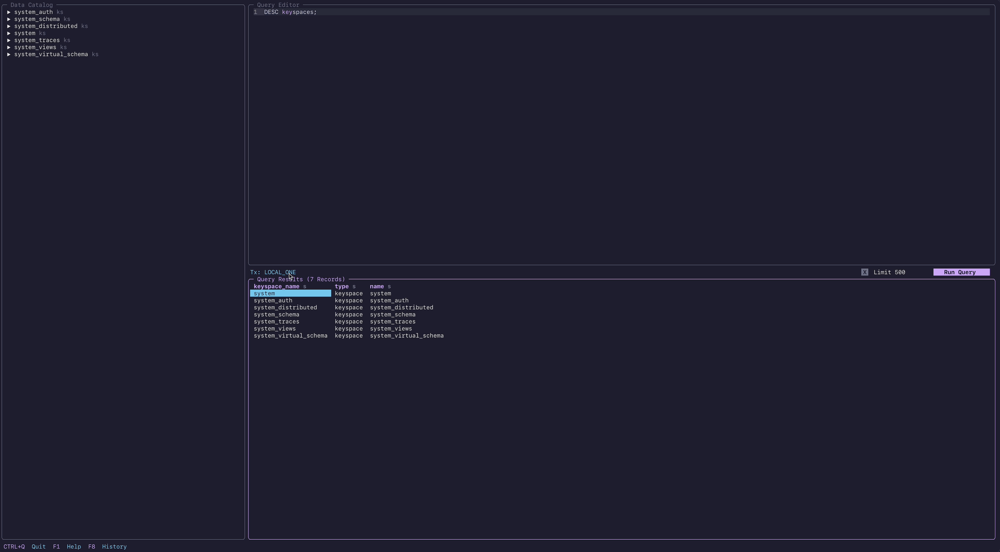

# harlequin-cassandra

> [!CAUTION]
> This adapter is unstable and experimental.
>
> Proceed with caution!

> [!WARNING]
> This adapter does not aim to support [Scylla](https://www.scylladb.com).

> [!NOTE]
> This adapter currently does not support execution profiles, load-balancing
> polices.

This is a [Cassandra](http://cassandra.apache.org) adapter for [Harlequin](https://harlequin.sh).  
It is based on [Datastax' cassandra-driver](https://github.com/datastax/python-driver).

## Integration With Harlequin

**Some quirks are to be expected.**

Cassandra doesn't use cursor(s), thus `HarlequinCursor` and `HarlequinConnection`
behave differently in this adapter.

A manual translation of `cassandra-driver` objects types to Python types is
required for Apache Arrow to work correctly.

In this adapter, [`Transaction Modes`](https://harlequin.sh/docs/transactions) refers to
Cassandra's consistency levels.



## Installation

`harlequin-cassandra` depends on `harlequin`, so installing this package will also install Harlequin.

### Using pip

To install this adapter into an activated virtual environment:

```bash
pip install harlequin-cassandra
```

### Using poetry

```bash
poetry add harlequin-cassandra
```

### Using pipx

If you do not already have Harlequin installed:

```bash
pip install harlequin-cassandra
```

If you would like to add the Cassandra adapter to an existing Harlequin installation:

```bash
pipx inject harlequin harlequin-cassandra
```

### As an Extra

```bash
pip install harlequin[cassandra]
```

## Usage and Configuration

You can open Harlequin with the Cassandra adapter by selecting it with the `-a` option and passing an initial hostname and credentials(if required).

```bash
harlequin -a cassandra "localhost" --username "cassandra" --password "cassandra"
```

Many more options are available; to see the full list, run:

```bash
harlequin --help
```

## Things To Explore

Missing advanced configuration that may be of interest:

- [ ] Add an option to support execution profiles.
- [ ] Add an option to support load-balancing policies.
